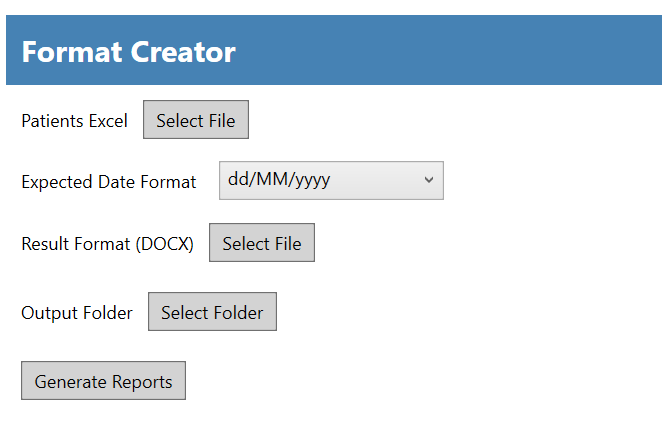

# CreadorDeFormatos

A WPF application that generates Word reports from Excel user data using DocX and EPPlus.

Here’s what the UI looks like:

## Features
- Load user data from Excel.
- Replace placeholders in a Word template.
- Generate a consolidated report. Headers and footers cannot be added properly due to library limitations.
- Progress bar for long operations.
- Configurable date format and language support.

## Usage
1. Select the **Excel file** containing user data. First row is ignored. Second row should have headers like `NAME`, `DATE`, etc.
2. Select the **Word template (DOCX)** with placeholders like `{NAME}`, `{DATE}`.
3. Select the **output folder**.
4. Choose the **date format** from the dropdown before generating reports to avoid confusion between U.S. and international formats.
5. Click **Generate Reports**.
6. The application will create a consolidated Word document with all user results.

## Configuration
- Language options are stored in resource files (`Resources.resx`).
- Date format options can be customized in the ComboBox or via configuration.

## Requirements
- .NET 6 or later
- EPPlus
- DocX
